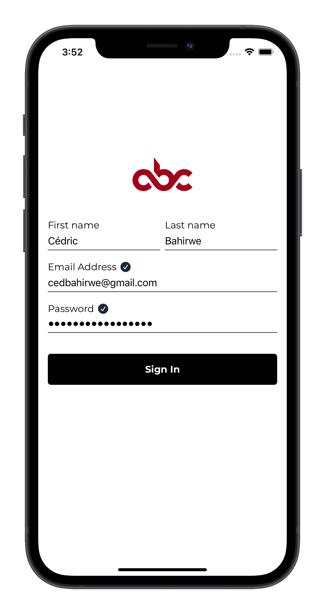
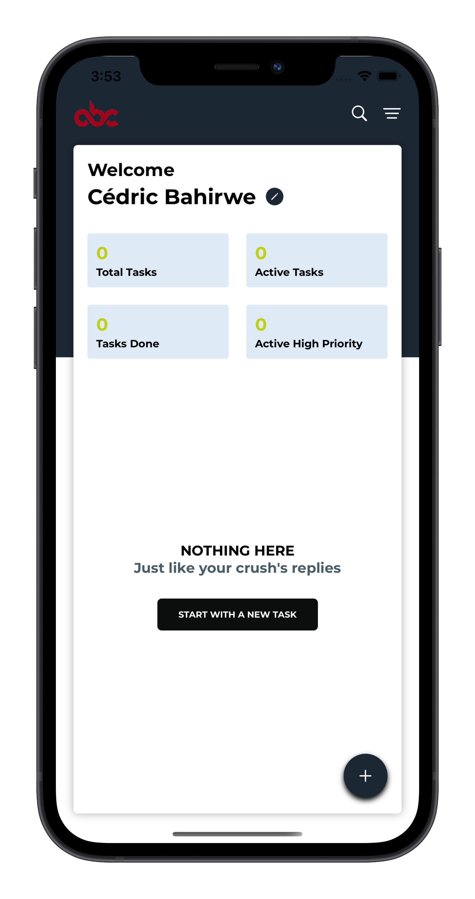
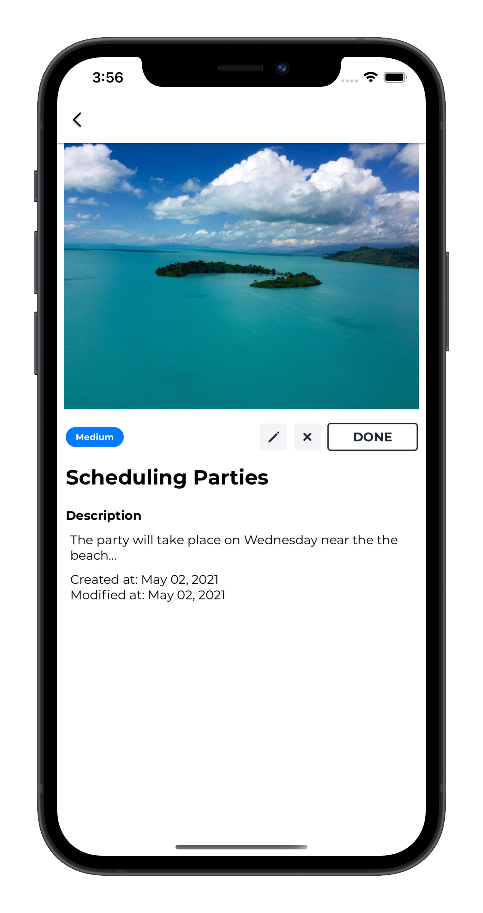
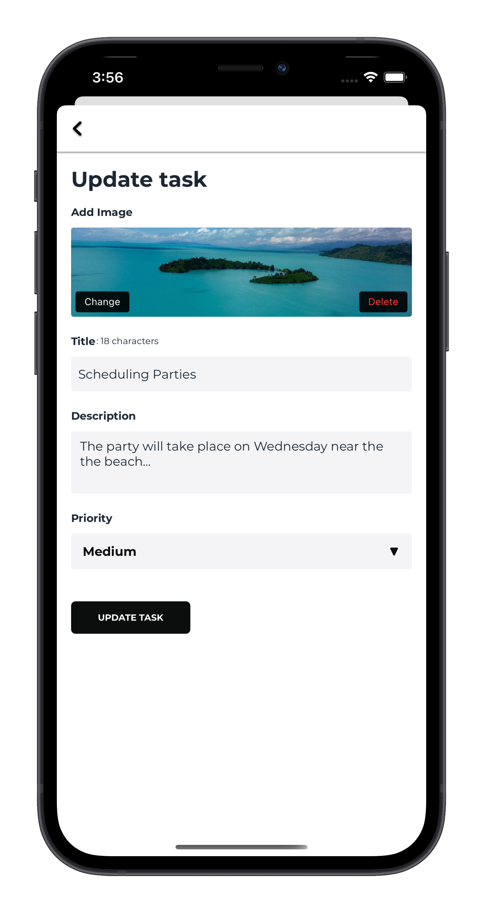

# DOIT

To-Do App should allow the following operations on a todo item:

Create, Update, Read, Delete

### 🏗Object/Modal Structure

A todo item is made of:

- Title
- Description
- Priority (LOW,MEDIUM,HIGH)
- CreateDate(date of creation of the todo item)
- ModifiedDate(date of modification of the todo item)

### 🔖Requirements

- Someone can create / update a todo item by sending:

  - title
  - description
  - priority

  The date of creation & modification should be time stamped automatically when created

- All of the fields are required
- Someone can read one or many todo items
- Someone can delete a todo item
- THE DATA SHOULD BE STORED LOCALLY (app memory, app database)

Login View                   |  Home View
:-------------------------:|:-------------------------:
  |  

Details View                 |  Update View
:-------------------------:|:-------------------------:
  |  

## TakeAways 🚀

- **Deep understanding of agile methodology to build and ship producs**
- **Understand the MVP, (cfr this whole app has been built in less than 10 hrs)**
- **Usage of UserDefaults Api to store data locally**
- **Latest SwiftUI features + Automatic Light/Dark Mode Support**

## Special Thanks to:

1. [Vainqueur Bihame](https://github.com/WinnersProx) for his inspiration ✨.

### ✨Upcoming features

- Integrate with [Firestore](https://firebase.google.com/docs/firestore) where the todo items will be stored and retrieved(Having same CRUD operations working with Firebase)
- - Use of CoreData as Local Database
